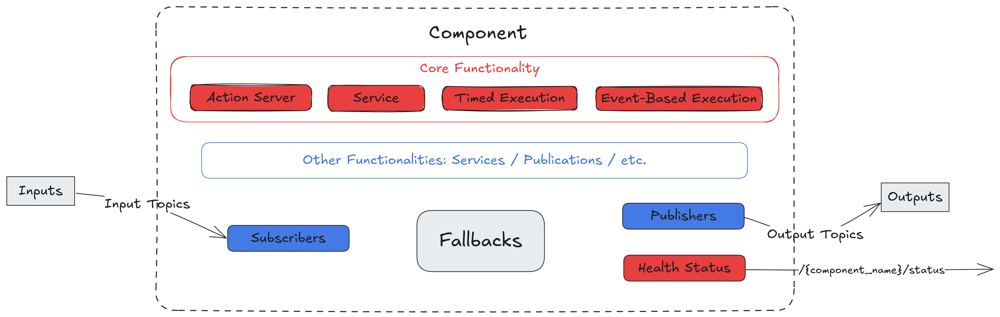
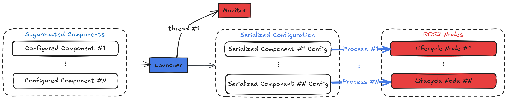

## automatika_ros_sugar (humble) - 0.2.6-1

The packages in the `automatika_ros_sugar` repository were released into the `humble` distro by running `/usr/bin/bloom-release --rosdistro humble automatika_ros_sugar` on `Fri, 17 Jan 2025 18:17:37 -0000`

The `automatika_ros_sugar` package was released.

Version of package(s) in repository `automatika_ros_sugar`:

- upstream repository: https://github.com/automatika-robotics/ros-sugar.git
- release repository: https://github.com/ros2-gbp/automatika_ros_sugar-release.git
- rosdistro version: `0.2.5-1`
- old version: `0.2.5-1`
- new version: `0.2.6-1`

Versions of tools used:

- bloom version: `0.12.0`
- catkin_pkg version: `1.0.0`
- rosdep version: `0.25.1`
- rosdistro version: `1.0.1`
- vcstools version: `0.1.42`


## automatika_ros_sugar (rolling) - 0.2.5-1

The packages in the `automatika_ros_sugar` repository were released into the `rolling` distro by running `/usr/bin/bloom-release --rosdistro rolling automatika_ros_sugar` on `Tue, 07 Jan 2025 17:55:28 -0000`

The `automatika_ros_sugar` package was released.

Version of package(s) in repository `automatika_ros_sugar`:

- upstream repository: https://github.com/automatika-robotics/ros-sugar.git
- release repository: https://github.com/ros2-gbp/automatika_ros_sugar-release.git
- rosdistro version: `0.2.4-1`
- old version: `0.2.4-1`
- new version: `0.2.5-1`

Versions of tools used:

- bloom version: `0.12.0`
- catkin_pkg version: `1.0.0`
- rosdep version: `0.25.1`
- rosdistro version: `1.0.1`
- vcstools version: `0.1.42`


## automatika_ros_sugar (jazzy) - 0.2.5-1

The packages in the `automatika_ros_sugar` repository were released into the `jazzy` distro by running `/usr/bin/bloom-release --rosdistro jazzy automatika_ros_sugar` on `Tue, 07 Jan 2025 17:52:25 -0000`

The `automatika_ros_sugar` package was released.

Version of package(s) in repository `automatika_ros_sugar`:

- upstream repository: https://github.com/automatika-robotics/ros-sugar.git
- release repository: https://github.com/ros2-gbp/automatika_ros_sugar-release.git
- rosdistro version: `0.2.4-1`
- old version: `0.2.4-1`
- new version: `0.2.5-1`

Versions of tools used:

- bloom version: `0.12.0`
- catkin_pkg version: `1.0.0`
- rosdep version: `0.25.1`
- rosdistro version: `1.0.1`
- vcstools version: `0.1.42`


## automatika_ros_sugar (humble) - 0.2.5-1

The packages in the `automatika_ros_sugar` repository were released into the `humble` distro by running `/usr/bin/bloom-release --rosdistro humble automatika_ros_sugar` on `Tue, 07 Jan 2025 17:49:38 -0000`

The `automatika_ros_sugar` package was released.

Version of package(s) in repository `automatika_ros_sugar`:

- upstream repository: https://github.com/automatika-robotics/ros-sugar.git
- release repository: https://github.com/ros2-gbp/automatika_ros_sugar-release.git
- rosdistro version: `0.2.4-1`
- old version: `0.2.4-1`
- new version: `0.2.5-1`

Versions of tools used:

- bloom version: `0.12.0`
- catkin_pkg version: `1.0.0`
- rosdep version: `0.25.1`
- rosdistro version: `1.0.1`
- vcstools version: `0.1.42`


## automatika_ros_sugar (rolling) - 0.2.4-1

The packages in the `automatika_ros_sugar` repository were released into the `rolling` distro by running `/usr/bin/bloom-release --new-track --rosdistro rolling --track rolling automatika_ros_sugar` on `Fri, 27 Dec 2024 15:54:21 -0000`

The `automatika_ros_sugar` package was released.

Version of package(s) in repository `automatika_ros_sugar`:

- upstream repository: https://github.com/automatika-robotics/ros-sugar.git
- release repository: unknown
- rosdistro version: `null`
- old version: `null`
- new version: `0.2.4-1`

Versions of tools used:

- bloom version: `0.12.0`
- catkin_pkg version: `1.0.0`
- rosdep version: `0.25.1`
- rosdistro version: `1.0.1`
- vcstools version: `0.1.42`


## automatika_ros_sugar (jazzy) - 0.2.4-1

The packages in the `automatika_ros_sugar` repository were released into the `jazzy` distro by running `/usr/bin/bloom-release --new-track --rosdistro jazzy --track jazzy automatika_ros_sugar` on `Fri, 27 Dec 2024 15:51:18 -0000`

The `automatika_ros_sugar` package was released.

Version of package(s) in repository `automatika_ros_sugar`:

- upstream repository: https://github.com/automatika-robotics/ros-sugar.git
- release repository: unknown
- rosdistro version: `null`
- old version: `null`
- new version: `0.2.4-1`

Versions of tools used:

- bloom version: `0.12.0`
- catkin_pkg version: `1.0.0`
- rosdep version: `0.25.1`
- rosdistro version: `1.0.1`
- vcstools version: `0.1.42`


## automatika_ros_sugar (humble) - 0.2.4-1

The packages in the `automatika_ros_sugar` repository were released into the `humble` distro by running `/usr/bin/bloom-release --new-track --rosdistro humble --track humble automatika_ros_sugar` on `Fri, 27 Dec 2024 15:37:16 -0000`

The `automatika_ros_sugar` package was released.

Version of package(s) in repository `automatika_ros_sugar`:

- upstream repository: https://github.com/automatika-robotics/ros-sugar.git
- release repository: unknown
- rosdistro version: `null`
- old version: `null`
- new version: `0.2.4-1`

Versions of tools used:

- bloom version: `0.12.0`
- catkin_pkg version: `1.0.0`
- rosdep version: `0.25.1`
- rosdistro version: `1.0.1`
- vcstools version: `0.1.42`


<picture>
  <source media="(prefers-color-scheme: dark)" srcset="docs/_static/ROS_SUGAR.png">
  <source media="(prefers-color-scheme: light)" srcset="docs/_static/ROS_SUGAR_DARK.png">
  
</picture>

ROS SUGAR 🍬 provides a whole lot of syntactic sugar for creating multinode ROS2 event-driven systems and management using an intuitive Python API.

- Learn more about the [**design concepts**](https://automatika-robotics.github.io/ros-sugar/design/index.html) in ROS Sugar 📚
- Learn how to [**create your own ROS2 package**](https://automatika-robotics.github.io/ros-sugar/use.html) using ROS Sugar 🚀

## Packages created using ROS Sugar

- [**Kompass**](https://automatikarobotics.com/kompass/): a framework for building robust and comprehensive event-driven navigation stacks using an easy-to-use and intuitive Python API
- [**ROS Agents**](https://automatika-robotics.github.io/ros-agents/): a fully-loaded framework for creating interactive embodied agents that can understand, remember, and act upon contextual information from their environment.

## Overview

ROS Sugar is built for ROS2 developers who want to create robust, event-driven systems with multiple nodes that are easy to use and can be configured and started with an intuitive python API. It provides primitives for writing ROS nodes and events/actions which can start/stop/modify the nodes, in the spirit of event driven software standard. ROS Sugar is also a replacement for the ROS Launch API.

A [Component](https://automatika-robotics.github.io/ros-sugar/design/component.html) is the main execution unit in ROS Sugar, each component is configured with [Inputs/Outputs](https://automatika-robotics.github.io/ros-sugar/design/topics.md) and [Fallback](https://automatika-robotics.github.io/ros-sugar/design/fallbacks.html) behaviors. Additionally, each component updates its own [Health Status](https://automatika-robotics.github.io/ros-sugar/design/status.html). Components can be handled and reconfigured dynamically at runtime using [Events](https://automatika-robotics.github.io/ros-sugar/design/events.html) and [Actions](https://automatika-robotics.github.io/ros-sugar/design/actions.html). Events, Actions and Components are passed to the [Launcher](https://automatika-robotics.github.io/ros-sugar/design/launcher.html) which runs the set of components as using multi-threaded or multi-process execution. The Launcher also uses an internal [Monitor](https://automatika-robotics.github.io/ros-sugar/design/monitor.html) to keep track of the components and monitor events.

## Base Component

<p align="center">
<picture align="center">
  <source media="(prefers-color-scheme: dark)" srcset="docs/_static/images/diagrams/component_dark.png">
  <source media="(prefers-color-scheme: light)" srcset="docs/_static/images/diagrams/component_light.png">
  
</picture>
</p>

## Multi-Process Execution

<p align="center">
<picture>
  <source media="(prefers-color-scheme: dark)" srcset="docs/_static/images/diagrams/multi_process_dark.png">
  <source media="(prefers-color-scheme: light)" srcset="docs/_static/images/diagrams/multi_process_light.png">
  
</picture>
</p>

## Installation

Install python dependencies using pip as follows:

`pip install 'attrs>=23.2.0' msgpack-numpy numpy-quaternion setproctitle`

Grab your favorite deb package from the [release page](https://github.com/automatika-robotics/ros-sugar/releases) and install it as follows:

`sudo dpkg -i ros-$ROS_DISTRO-sugar_$version$DISTRO_$ARCHITECTURE.deb`

## Building from source

```shell
mkdir -p ros-sugar-ws/src
cd ros-sugar-ws/src
git clone https://github.com/automatika-robotics/ros-sugar && cd ..
pip install pillow numpy opencv-python-headless 'attrs>=23.2.0' jinja2 msgpack msgpack-numpy numpy-quaternion setproctitle
colcon build
source install/setup.bash
```

## Copyright

The code in this distribution is Copyright (c) 2024 Automatika Robotics unless explicitly indicated otherwise.

ROS Sugar is made available under the MIT license. Details can be found in the [LICENSE](LICENSE) file.

## Contributions

ROS Agents has been developed in collaboration between [Automatika Robotics](https://automatikarobotics.com/) and [Inria](https://inria.fr/). Contributions from the community are most welcome.
