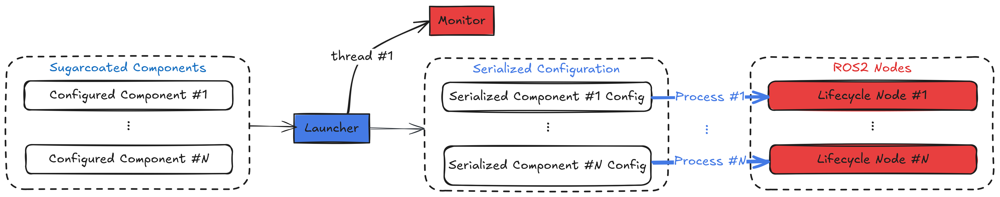

<picture>
  <source media="(prefers-color-scheme: dark)" srcset="_static/SUGARCOAT_DARK.png">
  <source media="(prefers-color-scheme: light)" srcset="_static/SUGARCOAT_LIGHT.png">
  
</picture>
<br/><br/>

> 🌐 [English Version](../README.md) | 🇨🇳 [简体中文](README.zh.md)

## ROS2 システムを構築する最もスイートな方法

**Sugarcoat** は、**ROS2** で複雑なイベント駆動型のマルチノードシステムを構築するために、多くの **シンタックスシュガー** を注入するメタフレームワークです。直感的な **Python API** を通じて、システム構築をより簡単にします。

## 主な特徴

| 特徴 | 説明 |
| :--- | :--- |
| **イベント駆動コア** | **Events** と **Actions** のための組み込みプリミティブにより、システムの **Components** を動的に構成・制御可能。 |
| **高い耐障害性** | **Fallbacks** と **Fault Tolerance** は設計の中心概念であり、システムの堅牢性と信頼性を保証します。 |
| **直感的な Python API** | クリーンで読みやすい Python コードで、ノード・イベント・アクションを含むシステム全体を設計可能。 |
| **ダイナミック Web UI** **（新機能！）** | システムの監視・設定のために、動的で拡張可能な Web インターフェイスを自動生成。 |
| **Launch の代替** | ROS2 Launch API のより Pythonic な代替として、実アプリケーションにおける柔軟な実行時制御を提供。 |

## Sugarcoat を使用して構築されたパッケージ

- [**Kompass**](https://automatikarobotics.com/kompass/): 使いやすい直感的な Python API を用いて、堅牢で包括的なイベント駆動ナビゲーションスタックを構築するためのフレームワーク。
- [**EmbodiedAgents**](https://automatika-robotics.github.io/embodied-agents/): 周囲のコンテキスト情報を理解・記憶・行動できる対話型物理エージェントを作成するための完全なフレームワーク。

## はじめに

- Sugarcoat の[**設計コンセプト**](https://automatika-robotics.github.io/sugarcoat/design/index.html) を学ぶ 📚
- Sugarcoat を使用して [**独自の ROS2 パッケージを作成**](https://automatika-robotics.github.io/sugarcoat/use.html) する方法を学ぶ 🚀

## **（新機能！）** Sugarcoat Recipes のためのダイナミック Web UI を紹介

新しい **ダイナミック Web UI** 機能により、システムの可視性と制御性が次のレベルに進化しました。
[**FastHTML**](https://www.fastht.ml/) と [**MonsterUI**](https://monsterui.answer.ai/) によって構築されており、任意の Sugarcoat レシピのために完全に動的で拡張可能な Web インターフェイスを自動生成します。
これにより、手動でのフロントエンド開発が不要になります。

この機能によって、複雑なマルチノード ROS2 システムを瞬時に監視・設定可能な Web アプリケーションへと変換できます。

### 自動 UI 生成の実例

Web UI がさまざまなタイプの Sugarcoat レシピに対して、どのように簡単にインターフェイスを生成するかをご覧ください。

- **例 1：一般的な Q\&A MLLM レシピ**
  [**EmbodiedAgents**](https://automatika-robotics.github.io/embodied-agents/) の MLLM エージェントレシピ用に完全なインターフェイスを自動生成し、設定操作やロボットとのリアルタイムなテキスト入出力を提供します。

<p align="center">
<picture align="center">
  
</picture>
</p>

- **例 2：ポイントナビゲーション レシピ（Point Navigation Recipe）**
  [**Kompass**](https://automatikarobotics.com/kompass/) に基づくポイントナビゲーションシステムの自動生成 UI の例です。
  UI は地図データを自動的に描画し、ロボットにナビゲーション目標を送信します。

<p align="center">
<picture align="center">
  
</picture>
</p>

### 内部構成

- **自動設定 UI**：レシピ内のすべての **Components** の設定インターフェイスを動的に生成。
- **自動 I/O 可視化**：UI の **入力** と **出力** に対応するコントロールとデータ可視化を自動生成。
- **WebSocket ベースのストリーミング**：双方向で低遅延の **テキスト・画像・音声** データ通信を実現。
- **レスポンシブレイアウト**：入出力要素を明確で適応性の高いグリッドレイアウトで表示。
- **拡張可能な設計**：拡張を通じて、新しいメッセージタイプやカスタム可視化を容易に追加可能。

## Sugarcoat の仕組み

Sugarcoat のコアは、いくつかの基本概念の上に成り立っています：

- **コンポーネント（Component）**：主要な実行単位（ROS2 ライフサイクルノードの抽象化）。
  **入力／出力** と **フォールバック（Fallback）** の動作を設定し、各コンポーネントは自身の **ヘルスステータス** を報告します。
  [コンポーネントの詳細はこちら](https://automatika-robotics.github.io/sugarcoat/design/component.html)

<p align="center">
<picture align="center">
  <source media="(prefers-color-scheme: dark)" srcset="docs/_static/images/diagrams/component_dark.png">
  <source media="(prefers-color-scheme: light)" srcset="docs/_static/images/diagrams/component_light.png">
  
</picture>
</p>

- **イベントとアクション（Events & Actions）**：実行時にコンポーネントを動的に処理・再構成するための仕組み。
  [イベントの詳細](https://automatika-robotics.github.io/sugarcoat/design/events.html) ｜ [アクションの詳細](https://automatika-robotics.github.io/sugarcoat/design/actions.html)

- **ランチャー（Launcher）**：定義したコンポーネント、イベント、アクションを使用して、マルチスレッドまたはマルチプロセス実行でシステムを起動します。
  内部の **モニター（Monitor）** がコンポーネントのライフサイクルを管理し、イベントを追跡します。
  [ランチャーの詳細はこちら](https://automatika-robotics.github.io/sugarcoat/design/launcher.html)

<p align="center">
<picture>
  <source media="(prefers-color-scheme: dark)" srcset="docs/_static/images/diagrams/multi_process_dark.png">
  <source media="(prefers-color-scheme: light)" srcset="docs/_static/images/diagrams/multi_process_light.png">
  
</picture>
</p>

## 🛠️ インストール方法

Sugarcoat は ROS バージョン $\ge$ **Humble** に対応しています。

### パッケージマネージャーを使用する（推奨）

Ubuntu の場合：

`sudo apt install ros-$ROS_DISTRO-automatika-ros-sugar`

または、[リリースページ](https://github.com/automatika-robotics/sugarcoat/releases) から特定の deb パッケージをインストールできます：

`sudo dpkg -i ros-$ROS_DISTRO-automatica-ros-sugar_$version$DISTRO_$ARCHITECTURE.deb`

> **注意:** パッケージマネージャー内の `attrs` のバージョンが 23.2 未満の場合、pip で更新する必要があります：
> `pip install 'attrs>=23.2.0'`


## ソースからのビルド

```shell
mkdir -p ros-sugar-ws/src
cd ros-sugar-ws/src
git clone [https://github.com/automatika-robotics/sugarcoat](https://github.com/automatika-robotics/sugarcoat) && cd ..

# Install dependencies (ensure attrs>=23.2.0 is included)
pip install numpy opencv-python-headless 'attrs>=23.2.0' jinja2 msgpack msgpack-numpy setproctitle pyyaml toml

colcon build
source install/setup.bash
```

## 著作権

本配布物内のコードは、明示的に示されていない限り、著作権 (c) 2024 Automatika Robotics に属します。

Sugarcoat は MIT ライセンスの下で提供されます。詳細は [LICENSE](LICENSE) ファイルで確認できます。

## 貢献

Sugarcoat は [Automatika Robotics](https://automatikarobotics.com/) と [Inria](https://inria.fr/) の共同開発です。コミュニティからの貢献を歓迎します。

## 🎩 感謝の意を込めて

**ダイナミック Web UI** は、2 つの素晴らしいオープンソースプロジェクトによって支えられています。
これらの開発に尽力した Answers.ai チームに心から感謝します。

- [**FastHTML**](https://www.fastht.ml/): HTMX をベースにしたフレームワークで、動的な Web インターフェイスの自動生成を可能にします。
- [**MonsterUI**](https://monsterui.answer.ai/): 直感的でスタイリッシュな UI コンポーネントを提供します。

